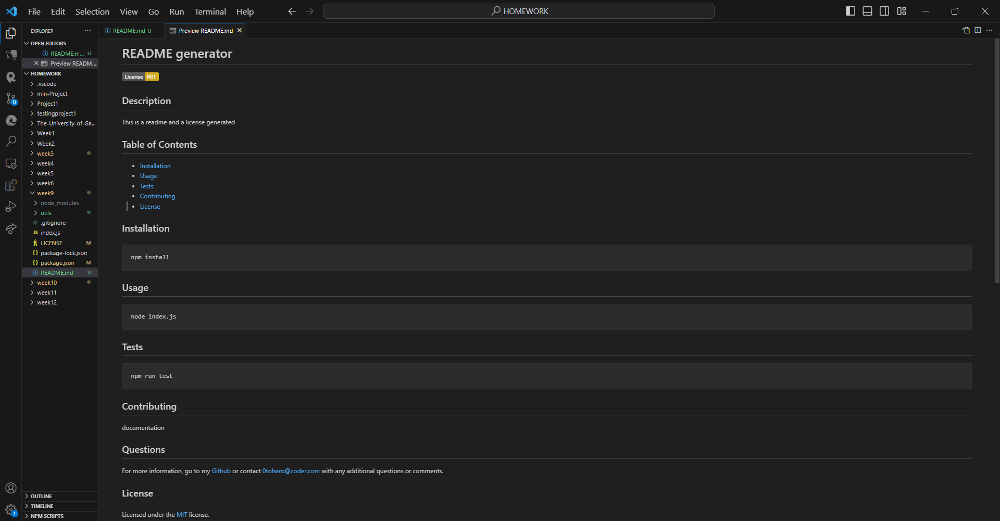
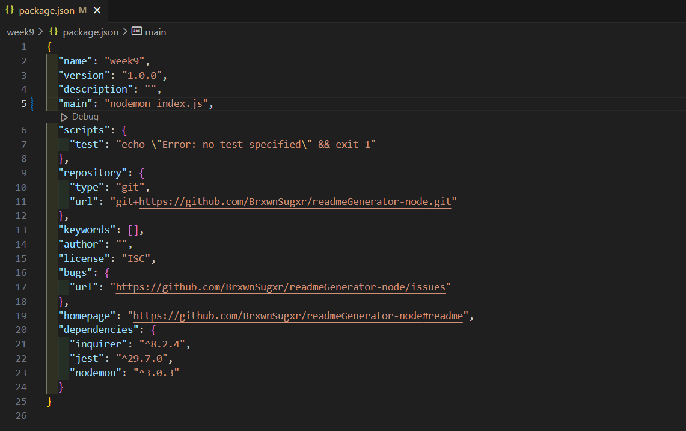
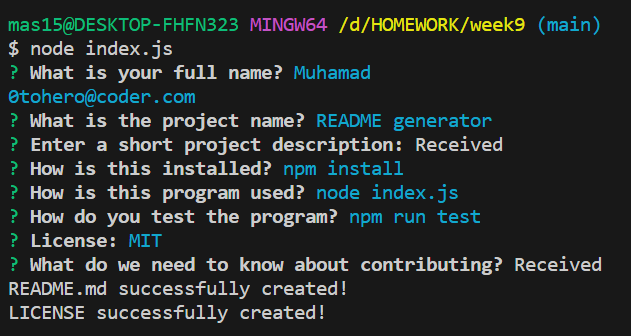

# README generator

[](https://opensource.org/licenses/MIT)

## Description

A Javascript program that generates README and LICENSE files based on the user's choices on questions generated by the program.

This program is ran using Node.js with modules Inquirer and Filesystem that handles the questions and their corresponding answers, and the writing of the files respectively.

## Table of Contents

- [Installation](#installation)
- [Usage](#usage)
- [Tests](#tests)
- [Contributing](#contributing)
- [License](#license)

## Installation

```
npm install
```

### Usage

```
node index.js
```

### Tests

```
npm run test
```

## Contributing





## Questions

For more information, go to my [Github](https://www.github.com/Sahid) or contact [0tohero@coder.com](mailto:0tohero@coder.com) with any additional questions or comments.

## License

Licensed under the [MIT](./LICENSE) license.
